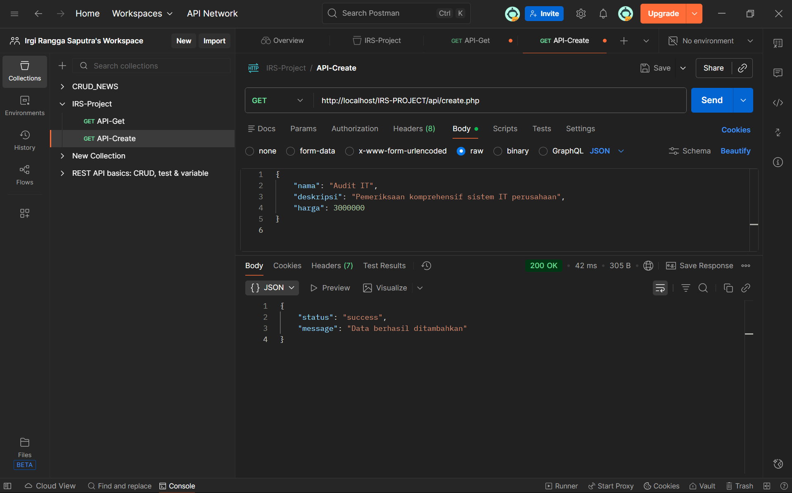
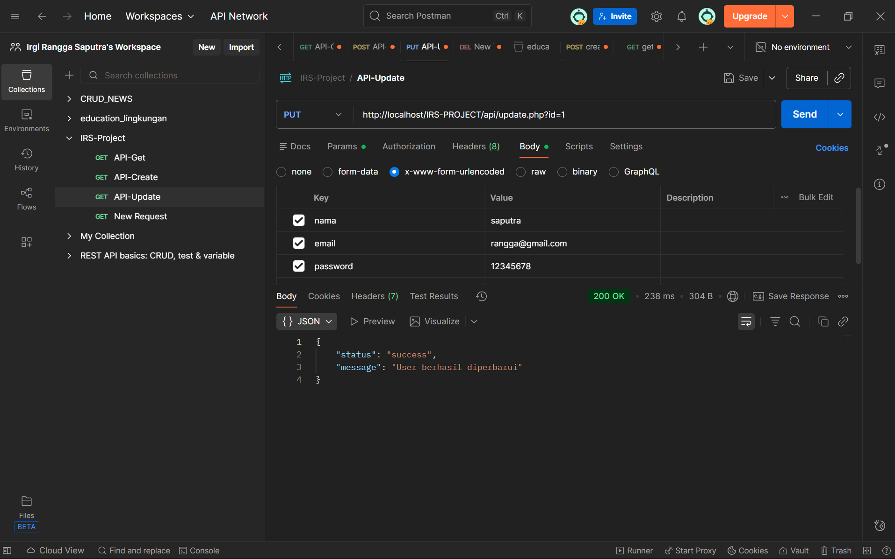
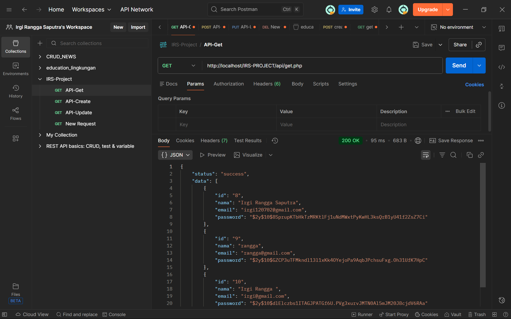
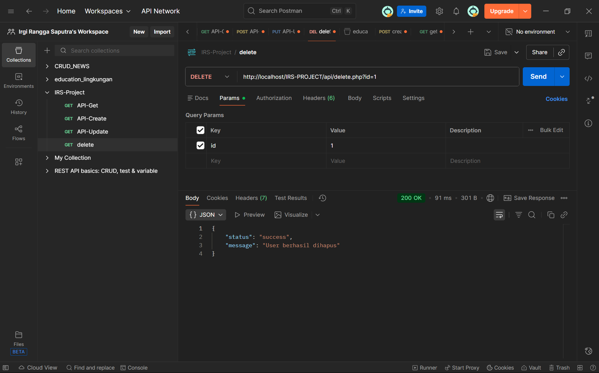

# IRS-Project

Simple CMS / service listing project (PHP + MySQL) built for demonstration and small deployments. The project shows a list of services (`layanan`) and includes pages for login, registration, profile, service detail, and an admin-contact modal.

---

## Fitur utama
- Halaman publik: `index.php`, `layanan.php`, `detail.php` (ambil data dari DB)
- Autentikasi: `login.php`, `register.php`
- Halaman pengguna: `menu.php`, `profil.php`, `riwayat.php`
- CRUD ringan untuk layanan via SQL import (`inserts_layanan.sql`) dan tampilan layanan
- Layout menggunakan Bootstrap 5

---

## Persyaratan
- PHP 7.4+ (disarankan PHP 8)
- MySQL / MariaDB
- Web server (Laragon digunakan selama development pada Windows)

---

## Struktur penting
- `index.php` — halaman utama
- `layanan.php` — daftar layanan (mengambil data dari tabel `layanan`)
- `detail.php` — menampilkan detil layanan berdasarkan `id`
- `login.php`, `register.php` — form autentikasi
- `menu.php` — area setelah login (user area)
- `profil.php`, `riwayat.php` — halaman user
- `includes/header.php`, `includes/footer.php` — layout header/footer
- `config.php` — koneksi database (`$conn` sebagai mysqli object)
- `assets/css/style.css` — style kustom
- `inserts_layanan.sql` — contoh data layanan (INSERT)

---

## Setup cepat (Windows + Laragon)
1. Pastikan Laragon / XAMPP / WAMP terpasang dan berjalan.
2. Letakkan folder proyek di `C:\laragon\www\IRS-Project` atau folder `www` server Anda.
3. Buat database MySQL bernama `irs_project` (atau ubah nama di `config.php`).
4. Jika belum ada tabel `layanan`, jalankan SQL migration (contoh di bawah) atau gunakan phpMyAdmin untuk impor `inserts_layanan.sql`.
5. Pastikan `config.php` ada di root proyek dan berisi kredensial DB yang benar. Contoh `config.php` dibuat otomatis di repo dan menghasilkan `$conn`.
6. Pastikan file gambar layanan ada di `assets/image/` (contoh: `consulting.jpg`, `manajement.jpg`, `pelatihan.png`).
7. Buka browser: `http://localhost/IRS-Project/` dan coba fitur.

Contoh perintah import SQL di terminal MySQL (jika Anda menyimpan file di folder proyek):

```sql
-- dari MySQL client
SOURCE C:/laragon/www/IRS-Project/inserts_layanan.sql;
```

Jika menggunakan phpMyAdmin: buka database `irs_project` → tab SQL → paste isi `inserts_layanan.sql` → Execute.

---

## Contoh migrasi (struktur tabel `layanan` minimal)
Jika tabel `layanan` belum ada, jalankan SQL berikut di database Anda:

```sql
CREATE TABLE layanan (
  id INT AUTO_INCREMENT PRIMARY KEY,
  nama VARCHAR(100) NOT NULL,
  image VARCHAR(255) DEFAULT NULL,
  deskripsi TEXT,
  harga INT DEFAULT NULL
);

CREATE TABLE users (
  id INT AUTO_INCREMENT PRIMARY KEY,
  nama VARCHAR(100) NOT NULL,
  email VARCHAR(100) NOT NULL,
  password VARCHAR(255) NOT NULL
);
```

Catatan: repo menunjukkan `users` & `layanan` di database pada screenshot — jika sudah ada, tidak perlu membuat ulang.

---

## Pengaturan koneksi
File koneksi di proyek adalah `config.php`. Pastikan kredensialnya cocok dengan environment Anda, misal:

```php
<?php
$servername = "localhost";
$username = "root";
$password = "";
$dbname = "irs_project";

$conn = new mysqli($servername, $username, $password, $dbname);
if ($conn->connect_error) {
    die("Connection failed: " . $conn->connect_error);
}
$conn->set_charset("utf8mb4");
?>
```

Jika Anda menggunakan file koneksi lain (mis. `koneksi/koneksi.php`), pastikan rujukan di file PHP konsisten.

---

## Debugging & Troubleshooting
- Jika muncul error seperti `Failed opening required 'config.php'`: pastikan file `config.php` ada di root proyek.
- Jika tombol tidak bisa diklik di UI: buka DevTools → Elements → periksa apakah ada overlay `.modal-backdrop` atau `pointer-events: none` pada elemen. Project sudah menyertakan beberapa CSS safety rules di `assets/css/style.css`.
- Jika `menu.php` terus mengarahkan ke `login.php` setelah login: periksa session keys; `login.php` menyimpan `$_SESSION['user_id']` dan `$_SESSION['user_name']` agar `menu.php` dapat membaca status login.

Enable error display (sementara untuk debugging) — tambahkan di awal file PHP saat debugging:

```php
ini_set('display_errors', 1);
ini_set('display_startup_errors', 1);
error_reporting(E_ALL);
```

Jangan tinggalkan ini aktif di lingkungan produksi.

---

## Keamanan & Catatan pengembangan
- Gunakan prepared statements saat menerima input pengguna (login/register telah diperbarui menggunakan prepared statements di repo).
- Simpan password menggunakan `password_hash()` dan verifikasi dengan `password_verify()` (sudah diterapkan).
- Untuk produksi, jangan gunakan kredensial default (`root` tanpa password).
- Sanitasi output dengan `htmlspecialchars()` untuk mencegah XSS (sudah ditambahkan di beberapa template seperti `detail.php`).

---

## Pengembangan selanjutnya (opsional)
- Tambahkan halaman admin untuk CRUD `layanan` (create/update/delete) dengan authentication yang lebih ketat.
- Migrasi struktur JSON di kolom `deskripsi` ke kolom terpisah (`scope`, `benefits`, `process`) jika ingin query terstruktur.
- Tambahkan pagination di `layanan.php` bila daftar layanan besar.

---

## Kontak
Jika butuh bantuan lanjutan, beri tahu saya file mana yang ingin ditingkatkan atau fitur yang ingin dibuat (contoh: admin CRUD, export/import CSV, autentikasi OAuth, dll.).

---

Terakhir: jalankan aplikasi lewat `http://localhost/IRS-Project/` dan ikuti langkah verifikasi di atas.
# IRS Project  
Sistem Informasi Layanan Konsultasi, Manajemen Proyek, dan Pelatihan

IRS Project adalah aplikasi berbasis web yang dikembangkan untuk menampilkan berbagai layanan perusahaan seperti konsultasi IT, manajemen proyek, serta pelatihan & workshop.  
Project ini dibuat menggunakan **PHP Native**, **Bootstrap 5**, dan **JSON** sebagai penyimpanan data layanan.

Aplikasi juga dilengkapi dengan fitur **login**, **menu utama**, dan halaman detail layanan yang dapat diakses oleh user.

---

## 🚀 Fitur Utama

### 🔹 1. Landing Page
- Menampilkan banner/hero modern
- Informasi singkat tentang IRS Project
- Daftar layanan diambil dari `info.json`

### 🔹 2. Autentikasi Login
- Sistem login menggunakan session PHP
- Membatasi akses menu utama untuk user yang login
- Tombol logout

### 🔹 3. Detail Layanan
Setiap layanan memiliki:
- Gambar layanan
- Tagline
- Deskripsi lengkap
- Ruang lingkup
- Manfaat
- Proses kerja

Semua informasi diambil dari file **JSON** → `data/info.json`

### 🔹 4. Menu Utama User
Setelah login, user diarahkan ke dashboard menu utama.

---

## 🛠️ Teknologi yang Digunakan

- PHP Native
- Bootstrap 5 (CDN)
- JSON (data layanan)
- HTML5 & CSS3
- Font Awesome Icons
- Laragon (development environment)

---

## 📁 Struktur Folder

```
IRS-Project/
│
├── assets/
│   ├── image/
│   │   ├── irs.png
│   │   ├── consulting.jpg
│   │   ├── manajement.jpg
│   │   ├── pelatihan.png
│   │
|   
│
├── data/
│   └── info.json
│
├── includes/
│   ├── header.php
│   └── footer.php
│
├── index.php
├── detail.php
├── login.php
├── logout.php
├── menu.php
└── README.md
```

## 🔐 Login System

Default login (sesuaikan dengan file login kamu):

```
Username : admin
Password : admin123
```

Setelah login, user diarahkan ke **menu.php** sebagai halaman menu utama.

---

## 📝 Data Layanan (JSON)

Data layanan disimpan di:

```
/data/info.json
```

Contoh struktur JSON:

```json
{
  "id": 1,
  "title": "Layanan Konsultasi IT",
  "summary": "Konsultasi pengembangan sistem informasi dan infrastruktur IT.",
  "tagline": "Solusi profesional untuk pengembangan sistem informasi modern.",
  "image": "assets/image/consulting.jpg",
  "description": "Deskripsi lengkap...",
  "scope": ["Item 1", "Item 2"],
  "benefits": ["Keuntungan 1", "Keuntungan 2"],
  "process": ["Langkah 1", "Langkah 2"]
}
```


## 📸 Screenshot 

screenshot halaman utama:


Layanan IT


Layanan Proyek


Layanan


Login


Menu Utama


Register


## API

Create



Update



Read



Delete



## 👨‍💻 Developer

**Irgi Rangga Saputra**  
IRS Project – Sistem Informasi Layanan  
GitHub: https://github.com/IrgiRanggaSaputra

---

## 📄 Lisensi

Proyek ini bersifat **open-source** dan dapat digunakan untuk pembelajaran serta pengembangan aplikasi web.

