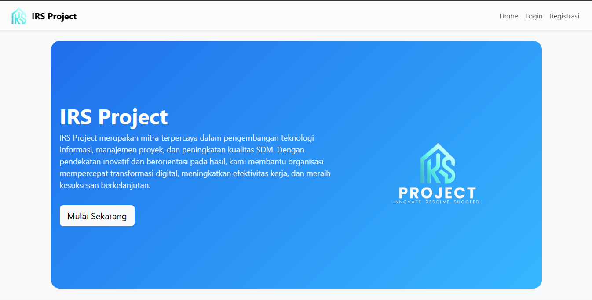
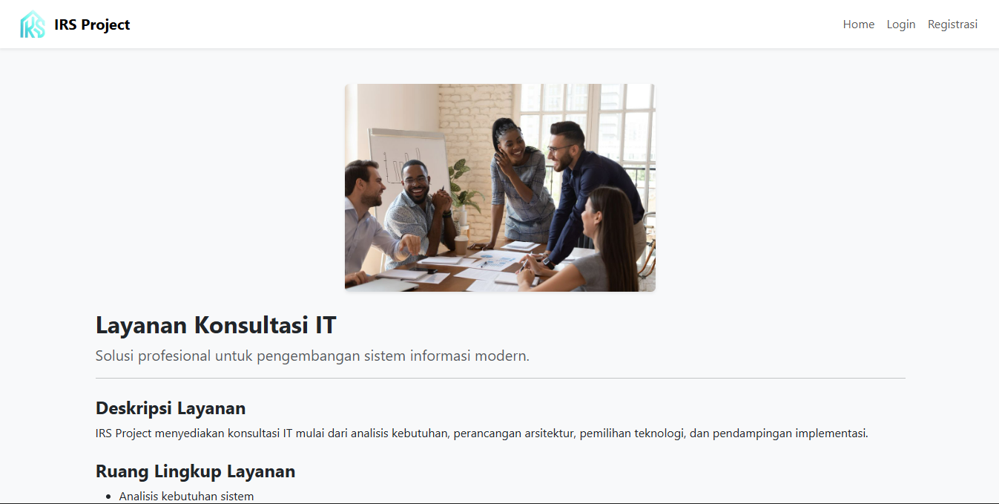
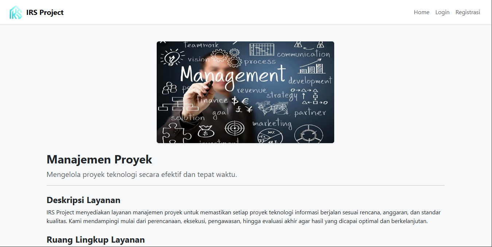
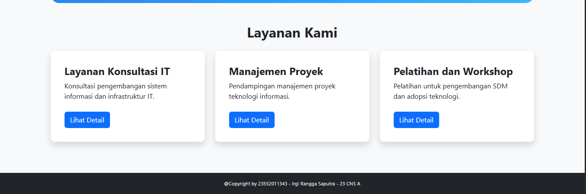
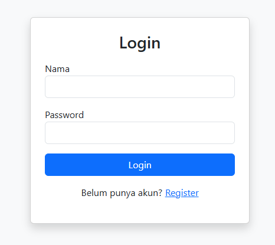
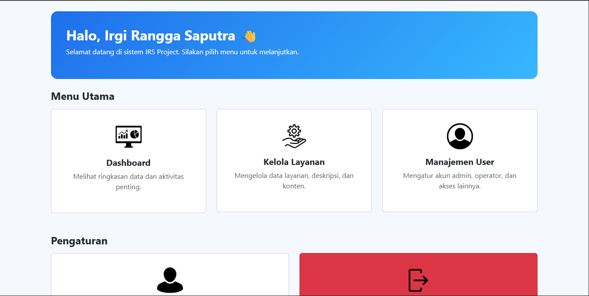

# IRS Project  
Sistem Informasi Layanan Konsultasi, Manajemen Proyek, dan Pelatihan

IRS Project adalah aplikasi berbasis web yang dikembangkan untuk menampilkan berbagai layanan perusahaan seperti konsultasi IT, manajemen proyek, serta pelatihan & workshop.  
Project ini dibuat menggunakan **PHP Native**, **Bootstrap 5**, dan **JSON** sebagai penyimpanan data layanan.

Aplikasi juga dilengkapi dengan fitur **login**, **menu utama**, dan halaman detail layanan yang dapat diakses oleh user.

---

## 🚀 Fitur Utama

### 🔹 1. Landing Page
- Menampilkan banner/hero modern
- Informasi singkat tentang IRS Project
- Daftar layanan diambil dari `info.json`

### 🔹 2. Autentikasi Login
- Sistem login menggunakan session PHP
- Membatasi akses menu utama untuk user yang login
- Tombol logout

### 🔹 3. Detail Layanan
Setiap layanan memiliki:
- Gambar layanan
- Tagline
- Deskripsi lengkap
- Ruang lingkup
- Manfaat
- Proses kerja

Semua informasi diambil dari file **JSON** → `data/info.json`

### 🔹 4. Menu Utama User
Setelah login, user diarahkan ke dashboard menu utama.

---

## 🛠️ Teknologi yang Digunakan

- PHP Native
- Bootstrap 5 (CDN)
- JSON (data layanan)
- HTML5 & CSS3
- Font Awesome Icons
- Laragon (development environment)

---

## 📁 Struktur Folder

```
IRS-Project/
│
├── assets/
│   ├── image/
│   │   ├── irs.png
│   │   ├── consulting.jpg
│   │   ├── manajement.jpg
│   │   ├── pelatihan.png
│   │
|   
│
├── data/
│   └── info.json
│
├── includes/
│   ├── header.php
│   └── footer.php
│
├── index.php
├── detail.php
├── login.php
├── logout.php
├── menu.php
└── README.md
```

## 🔐 Login System

Default login (sesuaikan dengan file login kamu):

```
Username : admin
Password : admin123
```

Setelah login, user diarahkan ke **menu.php** sebagai halaman menu utama.

---

## 📝 Data Layanan (JSON)

Data layanan disimpan di:

```
/data/info.json
```

Contoh struktur JSON:

```json
{
  "id": 1,
  "title": "Layanan Konsultasi IT",
  "summary": "Konsultasi pengembangan sistem informasi dan infrastruktur IT.",
  "tagline": "Solusi profesional untuk pengembangan sistem informasi modern.",
  "image": "assets/image/consulting.jpg",
  "description": "Deskripsi lengkap...",
  "scope": ["Item 1", "Item 2"],
  "benefits": ["Keuntungan 1", "Keuntungan 2"],
  "process": ["Langkah 1", "Langkah 2"]
}
```


## 📸 Screenshot 

screenshot halaman utama:



Layanan IT



Layanan Proyek



Layanan



Login



Menu Utama



Register


---

## 👨‍💻 Developer

**Irgi Rangga Saputra**  
IRS Project – Sistem Informasi Layanan  
GitHub: https://github.com/IrgiRanggaSaputra

---

## 📄 Lisensi

Proyek ini bersifat **open-source** dan dapat digunakan untuk pembelajaran serta pengembangan aplikasi web.

